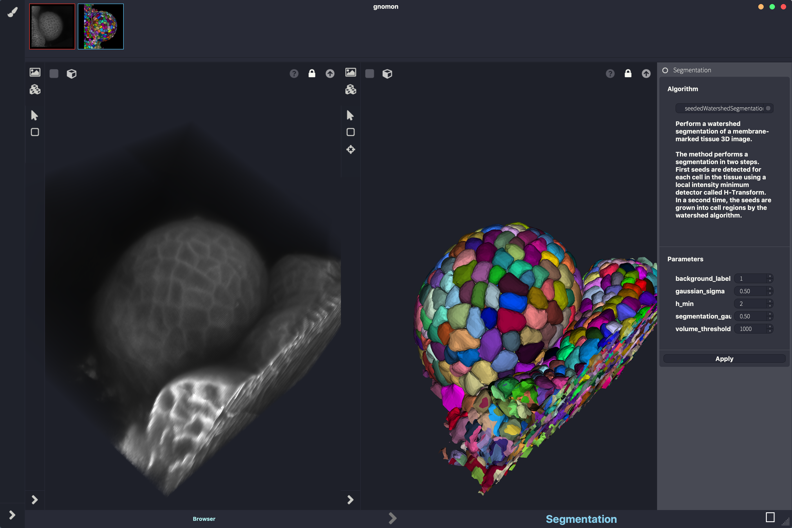
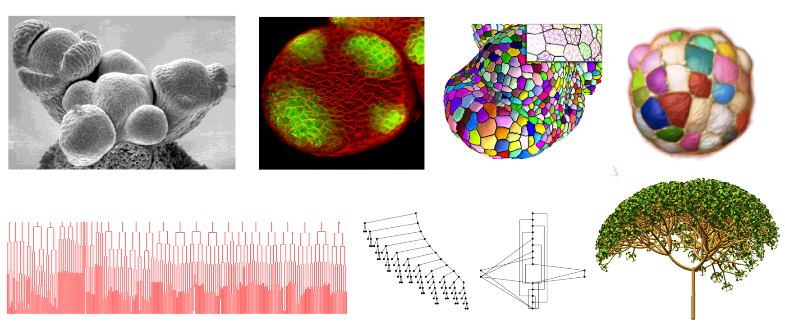
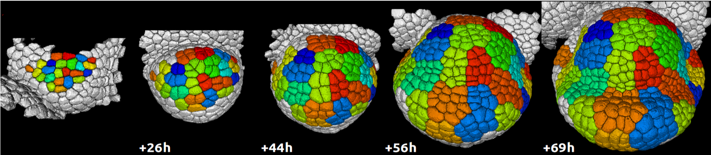
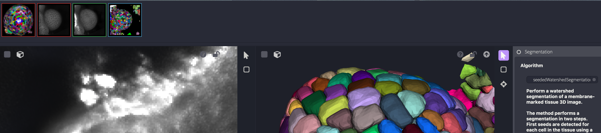
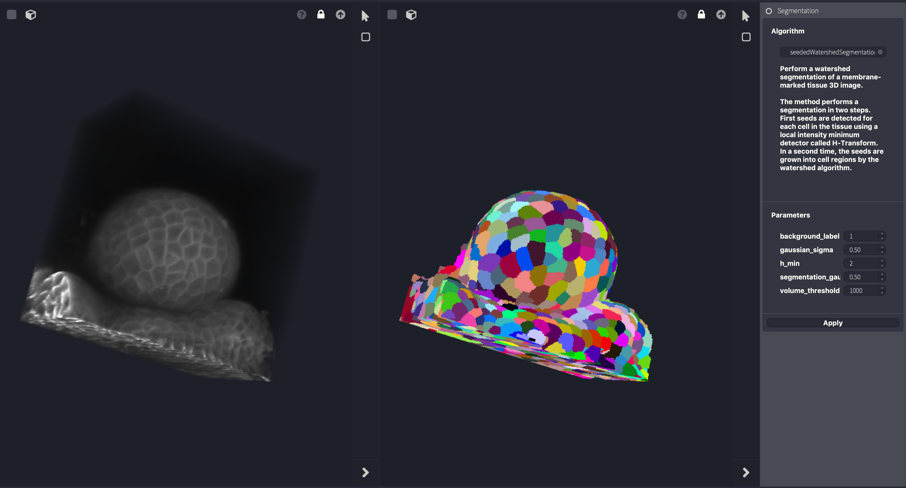
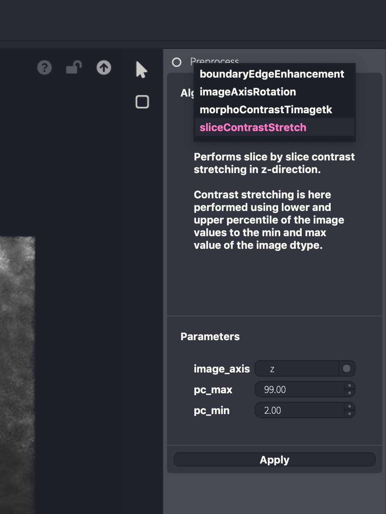

===================
Key Gnomon Concepts
===================
**Modified: 2019-12-11**

Gnomon provides a new *integrated modeling environment* (IME) for studying morphogenesis in biology.

This IME provides a *project manager*, a *session manager*, *workspaces* to apply families of algorithms to forms (to transform them), *plugins* corresponding to algorithms able to transform forms, a data bus called *the world* to handle computed forms, and *abstractions* that formalize and unify in the system the notion of :math:`(DS)^2` simulation.

    A typical screen of a Gnomon Session

Forms
=====

In Gnomon, a biological organism or organ is represented as *a form*. Formally, a form is a combinatorial object such as an image, a string, a tree, a graph, a matrix, a multiscale graph, a cell complex, an hyper-graph, *etc.*, representing the structure of a developing system in terms of its components and their arrangement at some scale(s) or a measure of this structure. These components may be overloaded with attributes representing geometric, biological or physical properties and often themselves represented as scalar or vectorial values. Altogether the form defines the state of the biological system or a measure of this state.

    Different example of forms in Gnomon:
    **top row from left to right** - microscope image of a meristem, confocal image of a meristem, mesh constructed from a segmented meristem, segmented ascidian embryo; **bottom row from left to right** - cell lineages of ascidian development, tree graph and its DAG compression, plant simulated branching structure)

A form can evolve in time and its components, their organization or their properties can vary. This defines dynamical systems with dynamical structure, :math:`(DS)^2`.

    Sequence of segmented images including cell lineages (cell colors) of a young growing flower primordium.

Measures make it possible to get partial information on system's form (state) from real data. For example, in the case of a developing embryo where the system's state is represented by a graph of cells, a measure of the state may be carried out using a light sheet microscope, providing images of the embryo state. These images can then be used to segment the cells, construct their topological graph, and possibly extract cell geometrical attributes (such as shape envelope, volume or compactness) or biologically-related attributes (such as genetic activity, hormone concentration, cell polarity, *etc.*).

Gnomon provides a new computational environment dedicated to the modeling and simulation of morphogenesis to manipulate these dynamical forms, construct them, explore them, simulate them.

Interestingly, Gnomon manipulates natively not only forms, but also sequences of forms, which formalizes the idea of a biological system developing throughout time. Many of its workspaces are able to handle directly temporal sequences of forms.

.. math::(parenthese a virer)

..    n_{\mathrm{offset}} = \sum_{k=0}^{N-1} s_k n_k

Form manager
============
The form manager is a bus of data structures representing forms and containing the objects and state variables shared by the different models. It is a set of data structures that can be globally accessed by all the workspaces. World objects are augmented with meta-data that indicate their characteristics and provenance.

    Form manager (top row of icons: stores the state of different forms that have previously been computed in different workspaces)

Workspaces
==========

A workspace is a central Gnomon concept that has been introduced to bring ergonomy at the forefront of the system. The user interacts with specific data structures and algorithms through dedicated workspaces. Basically, a workspace provides a graphical interface to a high-level operation that one may want to carry out on a form.

For example, a specific workspace is defined for 3D image segmentation operations. The precise segmentation algorithm used (e.g. watershed, ...) appears as a specific plugin in this workspace, and can be selected by the user in a plugin menu offered by the workspace.

    Workspace dedicated to 3D image segmentation

Other workspaces make it possible to run simulations. A LPy workspace for example is used to grow an initial tree structure (that may  be provided through the world by a file or another workspace) based on L-system rules implementing the evolution function :math:`F` in equation  into a new tree structure representing the form development at some specified time point.

Work in a workspace mainly consists in importing a form coming from the world (or from a file), choosing a plugin (dedicated algorithm for processing the form offered by the workspace) from a predefined list, setting the algorithm parameters, apply the algorithm to the form, and upload the final result back to the world.

Workspaces can import input forms or export computed output forms using drag-and-drop operation from and to the world.

Plugins
=======
Gnomon plugins refer to algorithms that can be used in the different workspace to process the input form. Each workspace defines its own list of plugins that are discovered dynamically by the workspace depending on the packages that have been downloaded in Gnomon. Parameters for this plugin are dynamically introspected and graphically presented to the user for fine tuning of the algorithm.

    The workspace right panel offers a selection of plugins (see popup menu) that are available in this workspace. The parameters below correspond to the parameters of the currently selected plugin.

Model (experimental)
====================

Model abstraction is defined in Gnomon to ease the manipulation and simulation of :math:`(DS)^2`. It consists of a Python class that make it possible to define standard functions that are required to run the simulation of a form development in Gnomon such as init(), step(), run(), animate(), rewind(), interpret(), set\_simulation\_param(), doc(), test().

* **init()**: defines the initial form of a simulation at time :math:`t_0`.
* step(): launches a step of simulation during a time :math:`\Delta  t` defined by set\_simulation\_param().
* **run()**: run :math:`N` steps of simulation during a time :math:`\Delta t` and interpret the result at the end of the simulation. Both :math:`N` and :math:`\Delta  t` are defined in the simulation context using set\_simulation\_param().
* **animate()**: run :math:`N` steps of simulation during a time :math:`\Delta  t` (or until a end condition becomes true) and interpret the result at each step of the simulation.
* **rewind()**: reset the simulation state with the initial state and parameters.
* **interpret()**: provides an interpretation of the current state that can be further exploited by other tools. This can be graphical for instance, *i.e.* a transformation of the form state into an object that can be interpreted by a graphical engine. But it can also be mechanical, etc.
* **set\_simulation\_param()**: makes it possible to set various parameters used by the simulation engine: :math:`\Delta t`, stop condition, time pause between two steps, etc.
* **doc()**: provides the documentation of the model and meta information such as authors names and contributions, copyright, references, complementary urls, ...
* **test()**: define tests that should be successful for the model to be considered as working properly.

Dataflow (Not yet implemented)
==============================
During a session, the user manipulates workspaces to process input forms and transform them as output stored in the world. In fact, the import/export operations carried out in each workspace from and to the world, are interpreted by Gnomon as the creation of links beween corresponding workspaces. The result is a graph whose nodes are the workspace and edges corresponds to data input and output by the different workspaces. This graph is called a \textitw{dataflow}. Its current state can be vizualize at any moment by bringing it to the front of the Gnomon display, manipulated to change some node attributes, etc.

The dataflow can be exported so that the whole simulation is run in batch in a shell on a series of new input data. This process is called \textit{dataflow iteration}.

Session manager (Not yet implemented)
=====================================
The session manager allows to configure the Gnomon platform for a particular task. It can create a new session, upload a previous session, save the current session with all the workspaces and context variables necessary to restore exactly the current working context.

Project (Not yet implemented)
=============================
a project implements a computational investigation of a biological or complex system. A project is made up of data structures, algorithms data, and dataflows. A project can therefore be executed and contains the information related to its own execution. This information can be used for reproducibility of the virtual experiment.

Creating a project: A project can be created in by defining all its components (data and models). Components may be either created by the modeller from scratch or imported into the project from other projects.

Project manager (Not yet implemented)
=====================================
The project manager makes it possible to handle all the files related to a given user project, the input data, her models and algorithms, output data, third party libs, screenshots, documentation, tutorials about the model, etc. in a simple, well defined manner. Ideally, the project manager is able to handle versioning of the project files and groups of files.

The project manager defines a bundle of all files necessary for the project to run and that can be easily introspected and transmitted to other parties to run the project with a precise version of Gnomon (defined by a specific conda install). This is particularly useful to provide a bundle of the project, ready to be run, as a supplementary code for a publication.

Gnomon packages (Not yet implemented)
=====================================
A Gnomon package is a set of data structures, plugins and possibly workspaces and form abstractions that are defined by a user or  a group  of users. A protocole to set-up a Gnomon package is provided in the Gnomon documentation.

If a package is mature, the developers may want to register it in the Gnomon store. The package must then comply stricly with the Gnomon package publication recommendations and will be reviewed for acceptance in  the  store.

Gnomon package manager (Not yet implemented)
============================================
The plugin manager makes it possible to fetch plugin from the Gnomon store or from some user's store. Stores are available on the web and mey be private or public. Only modules present in the Gnomon store are guaranteed to work in Gnomon (other modules

Gnomon distribution (Not yet implemented)
=========================================
A Gnomon distribution is a set of packages from the Gnomon store that all together provide a high-level functionality, e.g. cell-segmenting and tracking, 3D plant architecture modeling, multi)cellular simulation, etc.
