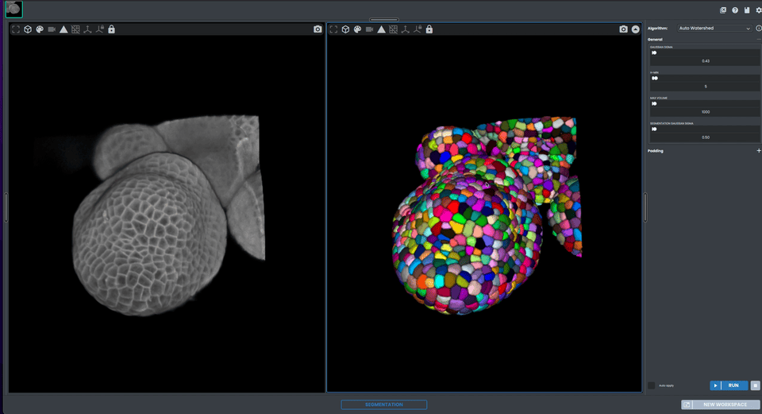
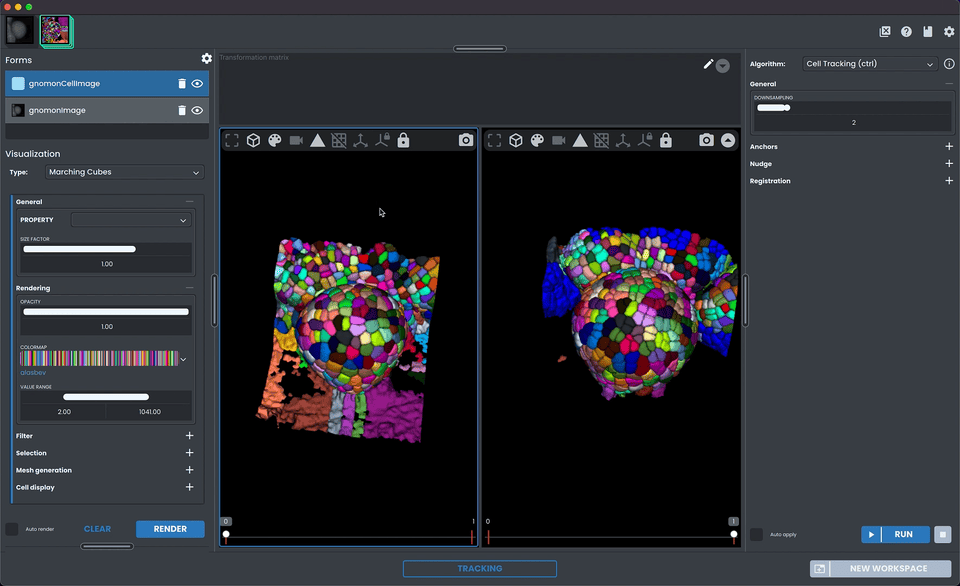
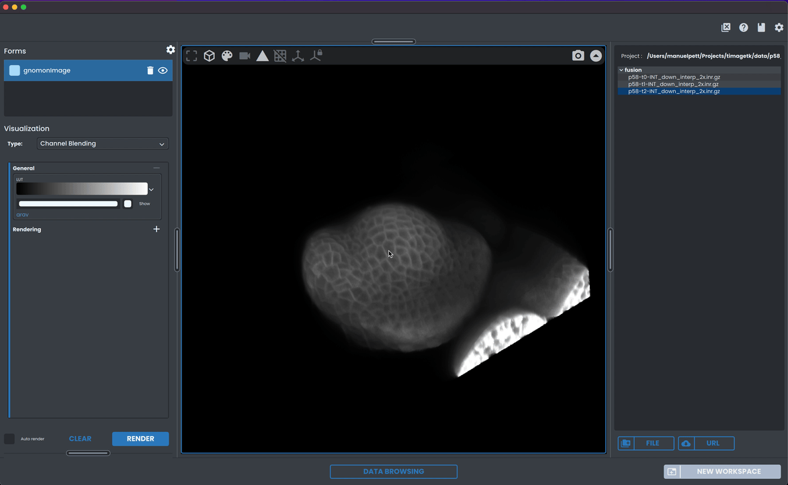

# Gallery

:::{toctree}
:maxdepth: 1
:hidden:
example_segmentation
example_cell_tracking
example1
example2
example_data
:::

```{raw} html
<style>
.gallery-grid {
    display: flex;
    flex-wrap: wrap;
    gap: 20px;
    justify-content: space-around;
}

.gallery-item {
    flex-basis: calc(100% / 2 - 40px);
    margin-bottom: 20px;
    text-align: center;
}

.gallery-item img {
    width: 100%;
    height: auto;
    border-radius: 10px;
    transition: transform 0.3s ease;
}

.gallery-item:hover img {
    transform: scale(1.1);
}

.gallery-title {
    margin-top: 10px;
    font-size: 1.2em;
    font-weight: bold;
}
</style>

<div class="gallery-grid">

<div class="gallery-item">
  <a href="example_segmentation.html">
    
    <div class="gallery-title">Image segmentation</div>
  </a>
</div>

<div class="gallery-item">
  <a href="example_cell_tracking.html">
    
    <div class="gallery-title">Image cell tracking</div>
  </a>
</div>

<div class="gallery-item">
  <a href="example1.html">
    
    <div class="gallery-title">Utilisation Basique</div>
  </a>
</div>

<div class="gallery-item">
  <a href="example2.html">
    
    <div class="gallery-title">Utilisation Avancée</div>
  </a>
</div>

</div>
