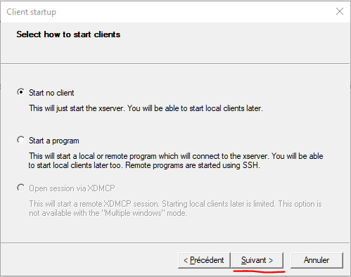
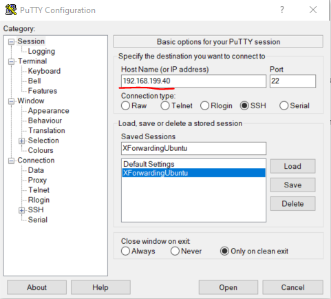
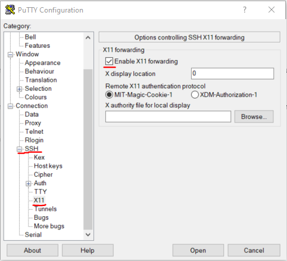

# Installation guidelines for Windows

## Install Gnomon with Windows Subsystem for Linux (WSL)

:::{note}
Sources used for these instructions are:

- [Open GUI apps on Windows Subsystem for Linux](https://www.youtube.com/watch?v=ymV7j003ETA&t=6s) (youtube)
- [VcXsrv](https://sourceforge.net/p/vcxsrv/wiki/VcXsrv%20%26%20Win10/) sur SourceForge.
:::

### 1. Install the following dependencies

1. [WSL 2](https://docs.microsoft.com/fr-fr/windows/wsl/install).
2. [Putty](https://www.putty.org).
3. **VcXsrv**, avalable on [Source Forge](https://sourceforge.net/p/vcxsrv/wiki/VcXsrv%20%26%20Win10/).

### 2. Configure WSL

A `$DISPLAY` variable has to be defined to choose on which screen/computer to display. To configure it do this:

```
\> export DISPLAY=$(route.exe print | grep 0.0.0.0 | head -1 | awk '{print $4}'):0
```

Now, if you print `$DISPLAY`, you should see an IP followed by `:0` such as:

```
> \> echo $DISPLAY
>
> \> 131.254.160.46:0
```

This IP is not constant and as to be set at each start of the WSL. You can tune your `~/.bashrc` to set this variable at each WSL startup is you want.

Install `awk` is needed (for example on debian based distributions:  `sudo apt install awk` ).

### 3. Configure X

#### VcXsrv

Once installed, launch **XLauch** and select options as shown below :

1. Select display setting for windows. Then click *Next*.


2. Clic on *Next*



3. Tick `Disable access control` (Note: *When it's ticked, the X server VcXsrv is open to extern connections.*). Clic on *Next*.


4. Clic on `Finish`.


#### Putty & SSH

Start **SSH service** on WSL :

```
> \> sudo service ssh start
```

On WSL, type the command `ip addr show eth0` and note the IP address. This step should be done at each start of WSL.

Launch Putty and configure the following parameters before connecting to WSL:

1. Type the IP you just noted



2. In the Menu `SSH > X11`, tick `Enable X11 Forwarding`.



3. You can now start the session.

### 4. Launch gnomon

You can now launch gnomon through the *WSL console*:
```
gnomon
```
