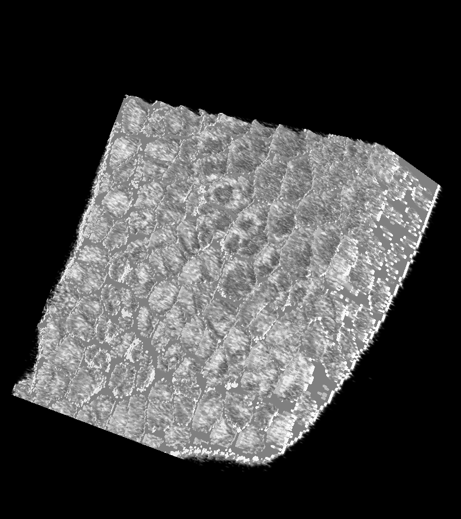

# Binary Image

{width=200px class="sd-rounded-1 sd-shadow-sm" align=center}

A gnomon Binary Image is a 3D raster image where the values are either True (not 0) or False(0).

## Default implementation
An implementation of this form can be found in the package [gnomon_package_imageenhancement](../../plugins/packages/gnomon_package_imageenhancement).
This package also contains a **reader**, a **writer** and a **visualization** plugin for Binary Images.

Binary Images can be read from files with the following extensions: `.inr, .inr.gz, .mha, .tif`.

## Workspaces using Binary Images

### Producers
 - [Data Browsing](../workspaces/data_browsing)
 - [Binarization](../workspaces/binarization)
 - [Python Algorithm](../workspaces/python_algorithm)

### Consumers
 - [Binarization](../workspaces/binarization)
 - [Image Meshing](../workspaces/image_meshing)
 - [Image Preprocessing](../workspaces/image_preprocessing)
 - [Segmentation](../workspaces/segmentation)
 - [Python Algorithm](../workspaces/python_algorithm)

