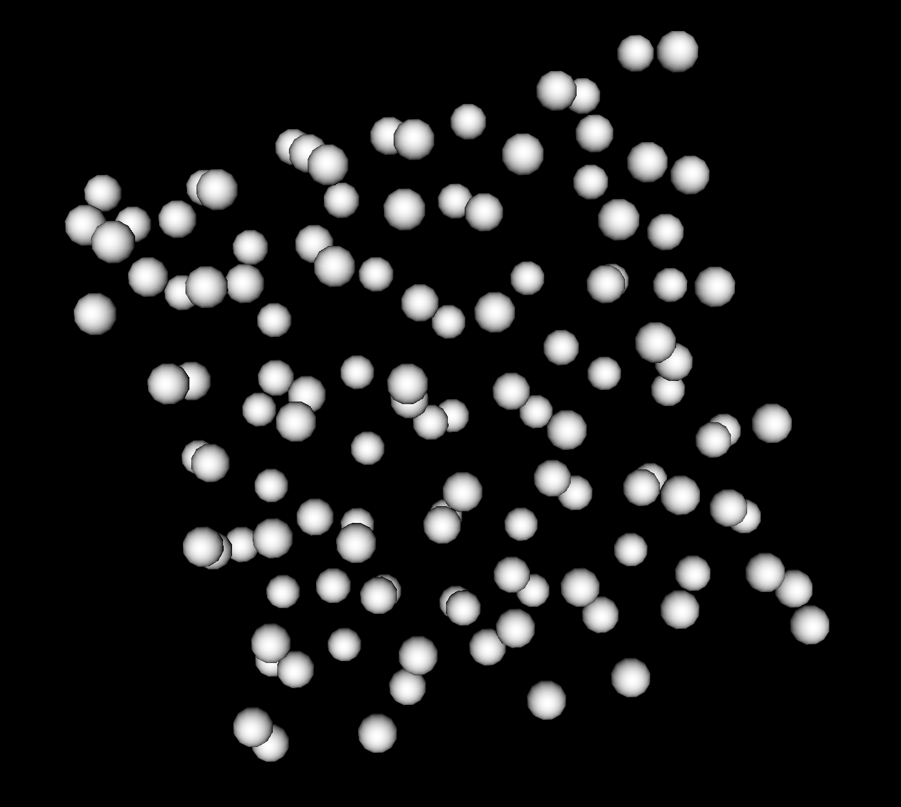

# Point Cloud Data

## Description
>Point cloud data structure hold points. It's a data frame which contains points and their properties.  
The corresponding class in gnomon is `gnomonPointCloudDataPandas`.  
It gives possibility to access information like:
- Number of points
- Points coordinate

## Default reader plugin
>The default reader of point cloud form is **gnomonPointCloudReaderDataFrame**. It loads a CSV file as 3D point cloud.  
This reader supports one extension `csv`.  

## Default writer plugin
>The default writer of point cloud form is **pointCloudWriterDataFrame**

## Gnomon Point Cloud Example



## Plugins which take Image as input
>Here is a non exhaustive list of some algorithms which take this form as input.  
- seededWatershedSegmentationTimagetk
- nucleiSignalQuantificationTimagetk


## Plugins which produce Image as output
> Here is a non exhaustive list of some algorithms which produce this form as output.  
- nucleiSignalQuantificationTimagetk
- nucleiDetectionTimagetk

## A Use Case, Signal Quantification
```python
from copy import deepcopy

import numpy as np
import pandas as pd

from dtkcore import d_inliststringlist
from dtkcore import d_real

from gnomon.utils import algorithmPlugin
from gnomon.utils.decorators import dataFrameOutput
from gnomon.utils.decorators import imageInput
from gnomon.utils.decorators import pointCloudInput
from gnomon.utils.decorators import pointCloudOutput

from gnomon.core import gnomonAbstractPointCloudQuantification

from timagetk.algorithms.signal_quantification import quantify_nuclei_signal_intensity


@algorithmPlugin(version="0.3.1", coreversion="1.0.1")
@imageInput('img', data_plugin='gnomonImageDataMultiChannelImage')
@pointCloudInput("df", data_plugin="gnomonPointCloudDataPandas")
@pointCloudOutput('out_df', data_plugin="gnomonPointCloudDataPandas")
@dataFrameOutput('data_df', data_plugin="gnomonDataFrameDataPandas")
class nucleiSignalQuantificationTimagetk(gnomonAbstractPointCloudQuantification):
    """Quantify image signal intensities on a 3D nuclei point cloud.
    """

    def __init__(self):
        super().__init__()

        self.img = {}
        self.df = {}
        self.out_df = {}
        self.data_df = {}

        self._parameters = {}
        self._parameters['signal_channels'] = d_inliststringlist("Channels", [""], [""], "Channels on which to compute the signal intensity")
        self._parameters['gaussian_sigma'] = d_real("Sigma", 0.5, 0., 50., 2, "Standard deviation of the Gaussian kernel used to smooth signal")

    def run(self):
        self.data_df = {}
        self.out_df = {}

        for time in self.df.keys():
            df = self.df[time]
            out_df = deepcopy(df)

            nuclei_points = df[['center_'+dim for dim in 'xyz']].values

            assert (time in self.img) and (self.img[time] is not None)

            img = self.img[time]

            for signal_name in self['signal_channels']:
                signal_img = img[signal_name]
                out_df[signal_name] = quantify_nuclei_signal_intensity(signal_img, nuclei_points, nuclei_sigma=self['gaussian_sigma'])

            self.out_df[time] = out_df
            
            self.data_df[time] = deepcopy(out_df)
            self.data_df[time]['time'] = time

        if len(self.data_df)>0:
            self.data_df = {0:pd.concat([self.data_df[time] for time in self.data_df.keys()])}

```