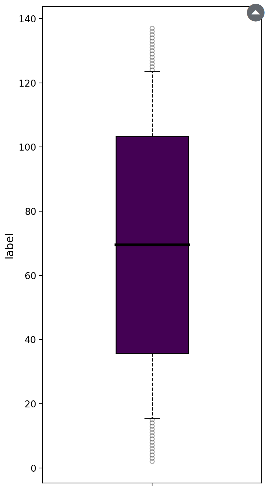
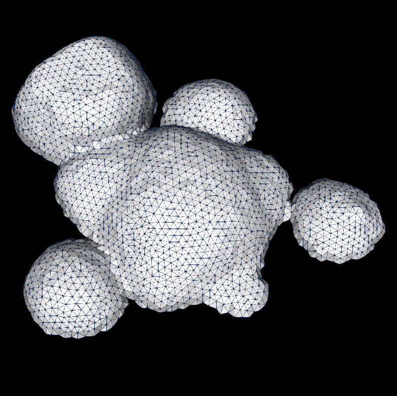

# Forms

Here is the list of the different forms[{fas}`book-open;sd-text-primary fa-2xs`](form-definition) defined by Gnomon. 
Usually a form is stored and moved around a time series.

A form in itself is only an interface. Their implementation, meaning how the actual data is stored and served to 
different plugins is defined in **data plugins** which are a special kind of plugin. Readers and writers are also defined in plugins.

To find which plugin (and plugin package) you need for the form you want to manipulate, you may look at the doc for this form
 or alternatively browse through the different plugin packages available [here](../plugins/index)

:::{list-table} Forms primitives
:widths: 15 30 10
:header-rows: 1

* - Name
  - Description
  - 
* 
  - [gnomonImage](forms/image.md)
  - A 3D image with multiple channels support
  - {.bg-warning w=100px align=center}
* 
  - [gnomonCellImage](forms/cell_image.md)
  - A 3D segmented image. The value of the voxel represents its class
  - {.bg-warning w=100px align=center}
* 
  - [gnomonBinaryImage](forms/binary_image.md)
  - A 3D image where the values are either true or false
  - {.bg-warning w=100px align=center}
* 
  - [gnomonDataDict](forms/data_dict.md)
  - A versatile form which can be used to store any data
  - {.bg-warning w=100px align=center}
* 
  - [gnomonDataFrame](forms/data_frame.md)
  - Two-dimensional tabular data. This data structure contains labeled axes (rows and columns)
  - {.bg-warning w=100px align=center}
* 
  - [gnomonLString](forms/lstring.md)
  - Axial tree. Used to represent the evolution of a branching structure
  - {.bg-warning w=100px align=center}
* 
  - [gnomonMesh](forms/mesh.md)
  - 3D surface or volumetric mesh
  - {.bg-warning w=100px align=center}
* 
  - [gnomonPointCloud](forms/point_cloud.md)
  - Hold points and their properties
  - {.bg-warning w=100px align=center}

:::

:::{toctree}
:maxdepth: 1
:hidden:

forms/binary_image
forms/cell_image
forms/data_dict
forms/data_frame
forms/image
forms/lstring
forms/mesh
forms/point_cloud
:::