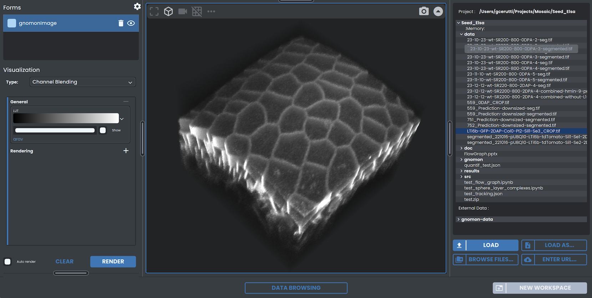
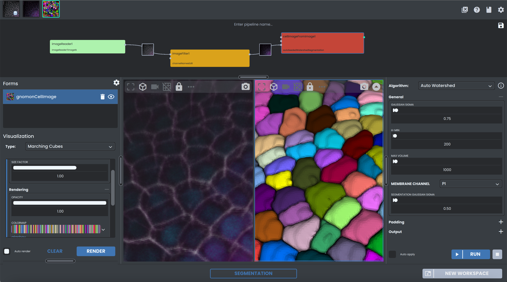
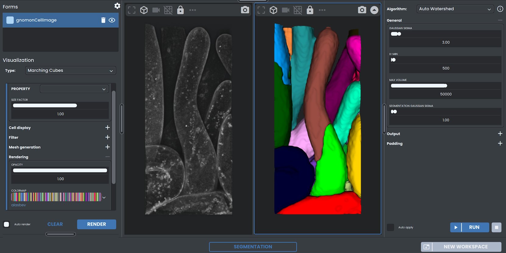

# Workspaces

**Workspaces** constitute the elementary bricks in the Gnomon user experience. You are going to chain processing steps to apply to your data by creating new Workspaces and by moving **Forms** from one Workspace to the next.

Generally speaking, a Workspace is the graphical counterpart of an **Algorithm**[{fas}`book-open;sd-text-primary fa-2xs`](algorithm-definition), through which the user will be able to:

* Set the Form(s) corresponding to its input
* Tune the values of its **Parameters**[{fas}`book-open;sd-text-primary fa-2xs`](parameter-definition)
* Run it and access to logs and progress
* Retrieve the Form(s) corresponding to its output

:::{include} diagrams/workspace_diagram.md
::: 

The typical layout of a Workspace consists of input and output **Views**[{fas}`book-open;sd-text-primary fa-2xs`](view-definition) at the center, rendering respectively the input and output Forms of the Algorithm, with two collapsible lateral menus to control the Algorithm (right) and the **Visualizations**[{fas}`book-open;sd-text-primary fa-2xs`](visualization-definition) of the active View (left).

(available-workspace-list)=
## Available workspaces

In Gnomon, through the  {fas}`folder-plus; fa-1x`&nbsp; **NEW WORKSPACE**  menu, you will have access to several types of **Workspaces**. Each Workspace corresponds to a specific task  to perform, and is generally defined by the types of its input and output Forms. 

The following table lists all the available Workspaces and sums up the types of Forms it expects as inputs, and will yield as outputs. Input forms are generally {bdg-success}`Mandatory` for the Workspace to perform its task, but it some cases it may also accept {bdg-success-line}`Optional` input Forms.

:::{list-table}
:widths: 12 10 10 24
:header-rows: 1

*   - Workspace Name
    - Input Forms
    - Output Forms
    - 
*   - [Data Browsing](workspaces/data_browsing)
    - 
    - {bdg-link-success}`Image <forms/image.html>`  {bdg-link-success}`BinaryImage <forms/binary_image.html>`   {bdg-link-success}`CellImage <forms/cell_image.html>`  {bdg-link-success}`Mesh <forms/mesh.html>`  {bdg-link-success}`CellComplex <forms/cellcomplex.html>`
    - 
*   - [Preprocessing](workspaces/preprocessing)
    - {bdg-link-success}`Image <forms/image.html>`  {bdg-link-success-line}`BinaryImage <forms/binary_image.html>`
    - {bdg-link-success}`Image <forms/image.html>`
    - 
*   - [Binarization](workspaces/binarization)
    - {bdg-link-success}`Image <forms/image.html>` 
    - {bdg-link-success}`BinaryImage <forms/binary_image.html>`
    - 
*   - [Segmentation](workspaces/segmentation)
    - {bdg-link-success}`Image <forms/image.html>`
    - {bdg-link-success}`CellImage <forms/cell_image.html>`
    - 
*   - [Image Registration](workspaces/image_registration)
    - {bdg-link-success}`Image <forms/image.html>`   {bdg-link-success-line}`DataDict <forms/data_dict.html>`
    - {bdg-link-success}`Image <forms/image.html>`   {bdg-link-success}`DataDict <forms/data_dict.html>`
    - 
:::

:::{toctree}
:maxdepth: 1
:hidden:

workspaces/home_screen
workspaces/data_browsing
workspaces/segmentation
:::
