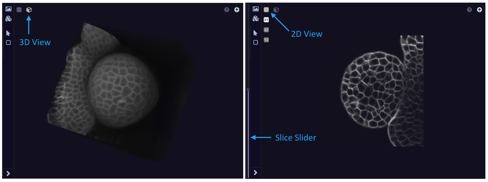

.. _Viewer:

=========
3D Viewer
=========

3D Viewers make it possible to explore 3D forms in 3 dimensions. Each 3D viewer is equipped with different option and tools:

* rendering tools
* orientation tools
* 3d action tools
* help/save options

.. figure:: Images/3DViewer_fig1.png
    :align: center
    :scale: 35
    :alt: alternate text
    :figclass: align-center

    3D Viewer

Rendering tools
===============

Rendering tools include two buttons corresponding to two separate spaces:

* **Image:** This space allows to select and modify the channels to display. For each channel, different options are available:

    * colormap
    * scaling
    * visibility: visible if blue circle/not visible if grey circle

* **3D Form Viewer:** Use the *Render* button to visualise new rendering options and *Clear* to clear the current 3D Viewer.

By default, **Image** panel is set to *gnomonVisualisationImageChannelBlending* which allows to visualize multiple channels
at the same time using all the volumetric data. However the *gnomonVisualizationImageSurface* can be select to visualize
only the surface of one of the 3D channel data. This last option is better to get a real surface rendering.

.. figure:: Images/3DViewer_fig2.png
    :align: center
    :scale: 40
    :alt: alternate text
    :figclass: align-center

    3D multi-modal data visualization using *gnomonVisualisationImageChannelBlending* (Left) or
    *gnomonVisualizationImageSurface* (Right)

You can also use the left-arrow at the bottom-left corner of the 3D Viewer to access the **Image** and
**3D Form Viewer** spaces.

Orientation tools
=================

Orientation tools include two buttons corresponding to the 2D view (slice) or the default 3D view. When clicking on the
2D view button, the XY plane is displayed by default. Also a slider at the left of the 3D Viewer appears allowing to
move along the slices.

    3D view (left) and 2D view (right) of an intensity 3D image. Notice the left slider for the 2D view allowing to
    move along the z-slices.

3D action tools
===============

3D action tools include two buttons allowing to:

* Change the 3D point of view

* Reset the 3D point of view (XY view)

Save/Help options
=================

An help button is available at the top-right corner of the 3D Viewer. Clicking on that button display some shortcuts
helping the interactive visualisation.

A save button representing by a up-arrow allows to send the 3D data of the viewer into the :ref:`FormManager` where
data can be reuse or export from Gnomon.

Other options
=============

Some options are not available for all the forms:

* Bottom slider: Stacked 3D data (3D+t) have a bottom slider allowing to move along the stacks (i.e. along the time).

* Locker icon: Some workspaces (ex: :ref:`SegmentationWorkspace`) use 3D Viewer with a locker button at the top-right corner. This locker allows to display the same 3D point of view between multiple 3D Viewer.

* ...
