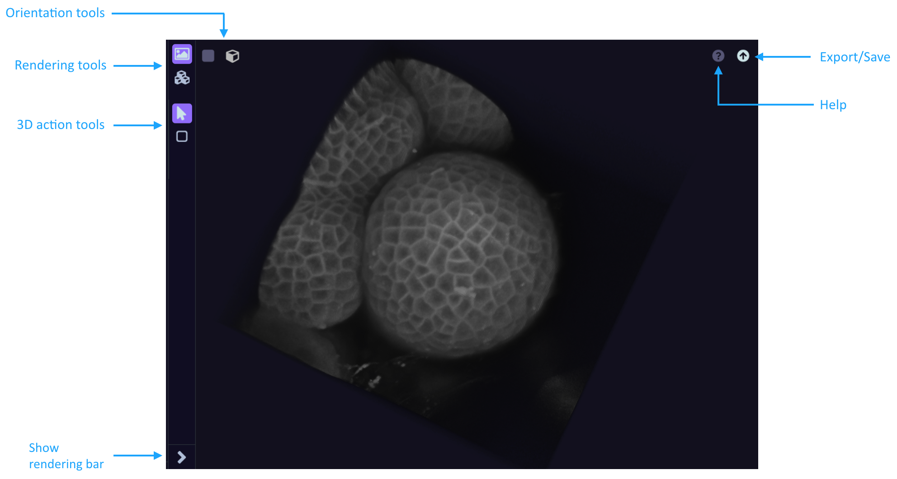
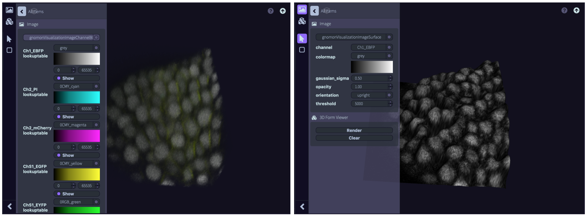

.. _Viewer:

=========
3D Viewer
=========

3D Viewers make it possible to explore 3D forms in 3 dimensions. Each 3D viewer is equipped with different option and tools:

* rendering tools
* orientation tools
* 3d action tools
* help/save options

    3D Viewer

Rendering tools
===============

Rendering tools include two buttons corresponding to two separate spaces:

* **Image:** This space allows to select and modify the channels to display. For each channel, different options are available:

    * colormap
    * scaling
    * visibility: visible if blue circle/not visible if grey circle

* **3D Form Viewer:** Use the *Render* button to visualise new rendering options and *Clear* to clear the current 3D Viewer.

By default, **Image** panel is set to *gnomonVisualisationImageChannelBlending* which allows to visualize multiple channels
at the same time using all the volumetric data. However the *gnomonVisualizationImageSurface* can be select to visualize
only the surface of one of the 3D channel data. This last option is better to get a real surface rendering.

    3D Data (multi-modal) visualization using *gnomonVisualisationImageChannelBlending* (Left) or
    *gnomonVisualizationImageSurface* (Right)

Orientation tools
=================

3d action tools
===============

Other options
=============

The visualization options are accessible in a menu from the vertical bar on the left of each figure. There, users
can set the colormap used to display each image, or switch between the different ways of interacting with each image.
For segmented images, users may also toggle between the volumetric and the surface-mesh representations of segmented
objects.

On top of each viewer, the horizontal bars provides icons to switch between a full 3D and a 2D-cut view of each image
(for three-dimensional data). Also, the visualization of the images in a workspace can be synchronized/desynchronized
by activating/deactivating the two lock icons in each viewer. In this way, rotations, translations and zooms applied to
the image in one viewer is automatically reported on the image in the other viewer (by default views are often
synchronized). In the same bar, users find a help button and the option to export each image to the form manager through
the UP arrow button.
