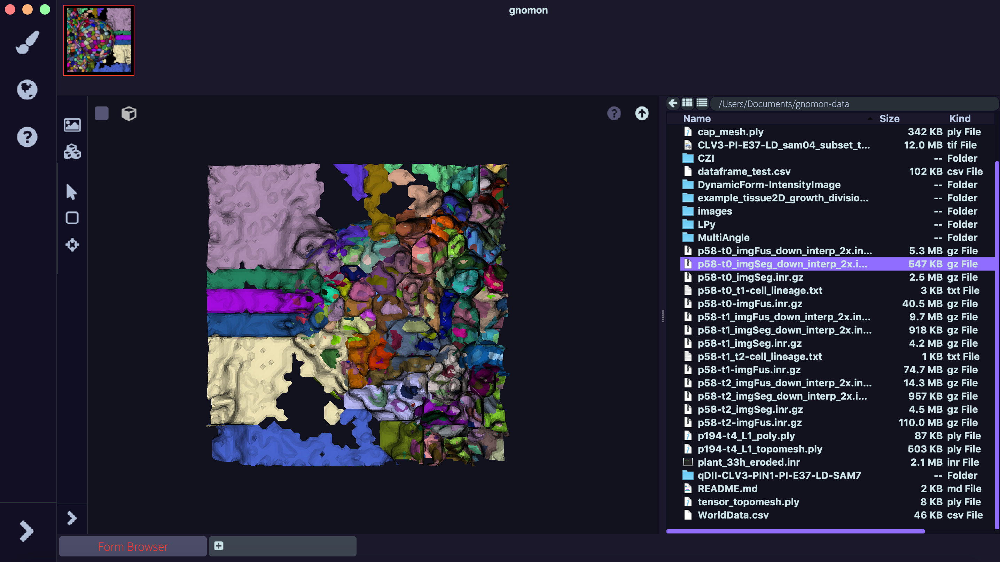

=================
Browser Workspace
=================

General presentation
====================

In the browser workspace one can navigate and import data in order to implement different functionalities of the Gnomon platform. Here one can create thumbnails of an imported image file on the form manager to be used with other workspaces.

* **Input**: A 3D data file (e.g. confocal image stack) in the formats inr.gz, .tif or  cgi.
* **Output**: A 3D representation of the image on the viewer, with possibility to interact with it (rotation, zoom, translation).

Outlay of the Browser workspace 
===============================

    Browser workspace

The workspace comprises of three main  areas:

* input :ref:`File browser`,
* output :ref:`Viewer`,
* Form manager area.

A file can be imported to the 3D viewer space by dragging and dropping the file from the file browser to the viewer. Clicking the “question mark” item on top right of the viewer shows a list of keyboard shortcuts for user interaction with the imported dataset. These include shortcuts for zooming in and out, switching to surface or wireframe rendering, resetting camera focus, rotation and translation of the imported object. 

Example of use
==============

**Prerequisite:** The file browser must contain at least one intensity image.

**Step 1:** Drag and drop a 3D image file from the file browser on the right to the viewer on the left. Use the mouse and keyboard shortcuts to rotate the image in 3D and translate it within the viewer area.

**Step 2:** In the viewer menu bar click on the "Image” item on top left. A panel with the visualization parameters opens.

**Step 3:** Set parameter values on the panel  (e.g set Range : (50 ,200)) and click “Render”. The representation on the viewer area is updated with the new range settings. Click "Clear" to erase the image from the viewer area. Toggle back the panel by clicking the “<“ button on bottom left.

**Step 4:** Click the square button on top left of the viewer. The image representation changes to a 2D image slice with a slider to the left. Click the “XZ” button and move the slider up/down to visualise changes in the image slice. Click on the “cube” button next to the square button to bring back the 3D representation.

**Step 5:** Press the UP arrow button on the top right of the viewer. This creates a thumbnail in the form manager at the top of the main window with the image as it is currently rendered in the viewer.

Related workspaces
==================

**Upstream of the Browser workspace:** Three-dimensional image data files that are inputs to the Browser Workspace might directly come from a directory on the user's computer.

**Downstream of the Browser workspace:** To implement functions of other Gnomon workspaces, one must first import a file into the browser workspace and create its thumbnail in the form manager. Then the file can be used in other workspaces like **Cell Image Analysis Workspace**  or  **Image Segmentation Workspace** by dragging and dropping the thumbnail into respective workspaces. 