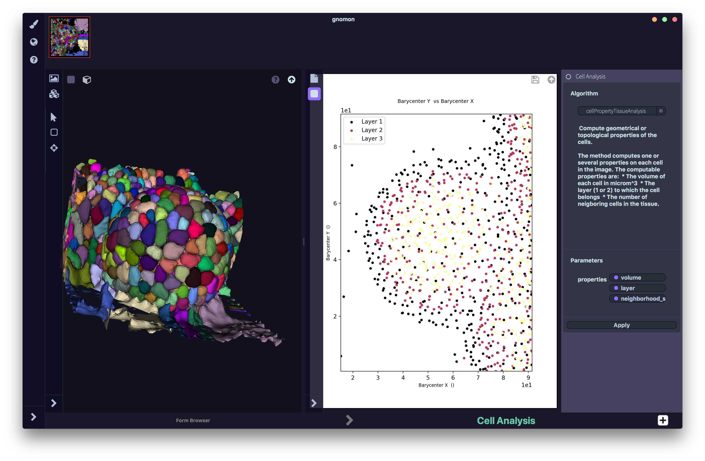

=======================
Cell Analysis Workspace
=======================

General presentation
====================

This workspace produces quantitative analyses of some properties of cells and tissues within a segmented image.
In particular, three algorithms are given to compute geometrical and topological properties of cells, to quantify average signal intensity, and to estimate tissue curvature with cellular resolution.
* **Input**: segmented image (together with signal information if signal average intensity is to be quantified)
* **Output**: dataframe, that can be displayed as a scatterplot [ Warning: I was only able to test the first algorithm ]

Outlay of the Cell Analysis workspace
=====================================

    Cell Analysis workspace

The workspace consists of three main specific zones:

* input :ref:`Viewer`,
* output :ref:`Viewer`,
* configuration panel.

The input 3D viewer (left) contains the segmented image to be analysed, while the output (rightmost) viewer displays the result of the selected analysis algorithm.
Once the parameters are set to their desired values, users can apply the algorithm to the segmented image shown in the leftmost viewer by clicking on the "Apply" button. The result is displayed on the rightmost viewer (note that depending on the algorithm and the input image, this operation may take a variable amount of time).

Example of use: Analysis of topological and geometrical properties of cells
===========================================================================

**Prerequisite:** The form manager must contain at least one segmented image.

**Step 1:** Open a Cell Analysis workspace.

**Step 2:** Drag-and-drop one segmented image from the form manager to the input 3D viewer.

**Step 3:** Select the *cellPropertyTissueAnalysis* algorithm at the top of the configuration panel.

**Step 4:** You can select the properties to be computed among volume, layer, and neighborhood_size.

**Step 5:** Click on the *Apply* button at the bottom of the configuration panel.

**Step 6:** You can select the two quantities to be represented as a 2D-scatterplot on the right viewer (for example, X-coordinate of the barycenter VS Y-coordinate of the barycenter of each cell). In addition, you can color each point in the plot according to a third variable (for example, the layer which each cell belongs to).

Related workspaces
==================

**Upstream of the Cell Analysis workspace:** Three-dimensional segmented images, inputs of the Cell Analysis workspace, might directly come from a file via the **Browser workspace** or might have been produced as outputs of the **Image Segmentation workspace**.

**Downstream of the Cell Analysis workspace:** ??