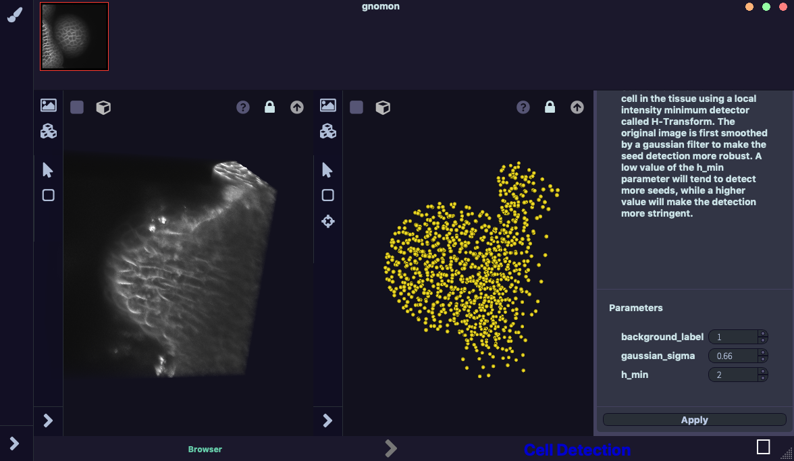

==================================
3D Tissue Cell Detection Workspace
==================================

General presentation
====================

This workspace performs two types of cell detection: nuclei detection and seed detection of each cell of a 3D 
tissue image. 

* **Input**: 3D tissue image. For the nucliei detection, the image should be in the form of 3 colour channels,
whereas for seed detection, the image should be in grayscale and the membranes in the image should be marked clearly. 

* **Output**: Detected nuclei or seeds in point cloud format.

Outlay of the Cell Detection workspace
======================================

    3D Tissue Cell Detection Workspace

The workspace consists of three main specific zones:

* input :ref:`Viewer`,
* output :ref:`Viewer`,
* configuration panel.

The input 3D viewer (left) contains the 3D tissue image, while the output (rightmost) viewer displays the result of the selected cell detection plugin.
Once the parameters are set to their desired values, users can apply the algorithm to the intensity image shown in the leftmost viewer by clicking on the "Apply" button. The result is displayed on the rightmost viewer (note that depending on the algorithm and the input image, this operation may take a variable amount of time).

Example of use: Nuclei detection in a 3D tissue image
=====================================================

**Prerequisite:** The form manager must contain at least one 3D tissue image in the form of 3 colour channels.

**Step 1:** Open a Cell Detection workspace.

**Step 2:** Drag and drop one 3D tissue image from the form manager to the input 3D viewer.

**Step 3:** Select the *nucleiDetectionNukem* algorithm at the top of the configuration panel.

**Step 4:** Click on the *Apply* button at the bottom of the configuration panel.

**Step 5:** Drag and drop the tissue image into the output viewer. The 3D tissue image and detected
nucliei point cloud will overlay, facilitating the assessment of the quality of detection achieved.

**Step 6:** (Optional) You can then play with parameters to tune the result. For example, you can change the
standard deviation of the Gaussian, min and max radius, intensity threshold, etc.

**Step 7:** The detected 3D point cloud can be exported to the form manager using the up-arrow at the top-right corner of the output 3d viewer.

Related workspaces
==================

**Upstream of the 3D Tissue Cell Detection workspace:** Three-dimensional tissue images, inputs of the Cell Detection Workspace, might  directly come from a file via the **Form Browser Workspace** or might have been produced as outputs of the **Image Fusion Workspace** or the **Image Preprocessing Workspace**.

**Downstream of the 3D Tissue Cell Detection workspace:** detected nuclei in 3D point cloud format, can then be quantitatively analyzed in the **Cell Image Analysis Workspace** or further processed in the **Cell Image Meshing Workspace**.