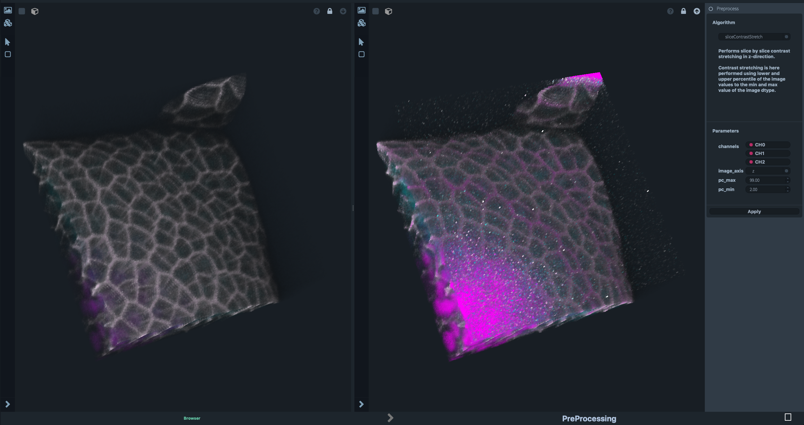

=================
PreProcessing
=================

Context of use
==============

This workspace allows preliminary work to be done on images, and offers different algorithms to improve rendering, for example by increasing the contrast of the different channels. This workspace uses images, both input and output.

Outlay of the Preprocessing workspace
=====================================

This workspace has three panels. The left one contains the image to be processed, the right one allows you to choose the algorithm to use, and the central panel provides the post-processing rendering.

Example of use
==============

By default, this workspace is used as follows. Load an image thumbnail from the Form Manager (link ?) and choose an algorithm - for example, `sliceContrastStretch`. Then choose which channel(s) the algorithm will be applied, calibrate the parameters, and choose wich direction to operate. The resulting image can then be manipulated and thumbnailed like a normal image -- changing the color schemes, camera, etc.

Typical follow-ups
==================
Any workspace involving image processing is appropriate for use after this one. For example,....