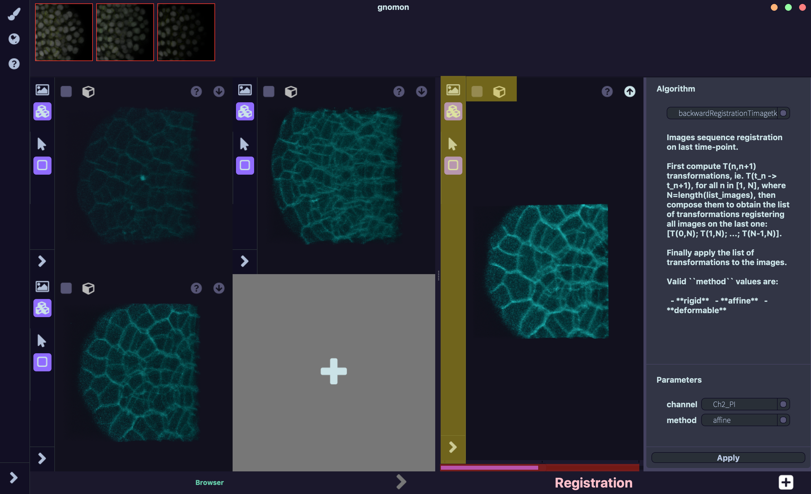

======================
Registration Workspace
======================

Context of use
==============

This workspace is dedicated to spatial or temporal registration using two or more intensity images (2D/3D).
Registration is the process that calculate the transformation that superimpose a *floating image* on a
*reference image* while maximizing a given similarity measure. Linear (rigid, affine) and non-linear transformations
can be estimated.

This workspace is particularly well-adapted for 4D images (3D + time) where the last time-image is used
as *reference* and other images are iteratively registered on it.

The registration algorithm is based on a block-matching strategy combines with a multi-scale hierarchy approach.
See [1] for more details.

- **input**: two or more intensity images (from microscopy confocal, light-sheet, ...) either 2D, 3D samples.

- **output**: two or more intensity images registered. The number of output images is equaled to the number of input images.

Outlay of the workspace
=======================

    Fig. 1: **Registration workspace**. Multi-input 3D viewer is placed on the left (three images imported),
    output 3D viewer on the center and the configuration panel on the right. Yellow area highlights the view option
    (same options for the input 3D viewer) and red area highlights the slider allowing to move along the output
    stacked images (here the second registered image i.e. the top-right corner input image registered).

The workspace is composed from left to right of three main specific areas:

- multi-input 3D viewer (
- output 3D viewer
- configuration panel

The multi-input 3D viewer allows to add a custom number of images to register (>= 2 images).
By default three empty containers are available. Additionnal empty container can be obtained by
clicking on the '+' container. **Containers are ordered from top to bottom and left to right** (i.e. the last
image will be at the bottom-right corner image while the first one will be at the top-left corner).

Like the other workspaces input images can be drag/drop from the **world** into the wanted container. View options
of the containers (yellow area in fig. 1) are described in detail here (**put link!!**).

In the configuration panel, Gnomon version 1.0 includes the backwardRegistrationTimagetk registration plugin
(iterative method described above and [1]) available by default. Parameters of this method include:

- type of transformation (rigid, affine or deformable)
- channel to used if multi-modal images

Registration algorithm can be launched using the "Apply" button at the bottom of the panel. Notice that the operation
may take a long time to compute if a lot of images need to be proceed and/or if deformable method has been selected.

When the registration is finished the stacked output registered images will appear in the output 3D viewer. A slider situated at
the bottom of the output image (red area in fig. 1) allows to navigate between the stacked registered images. Notice that the
number of output stacks is equaled to the number of input images. The last output stacked image is the same as the last input
image (because it is the *reference image*). Output stacked images can be saved or re-use through the up-arrow button.

Example of use
==============

**3D+t intensity images to registered**:

    1. Open each 3D images in the **Browser workspace** and save them in the **world**.

    2. Open the **Registration workspace**. If more than three images need to be registered add new containers by clicking on the '+' special container.

    3. Drag/Drop in the input containers each images in chronological order from left to right and from bottom to top (the first image is at the top-left corner while the last image is at the bottom-right corner).

    4. In the configuration panel, select the channel to used (if multimodal images) and the wanted method. Remember that deformable method will be longer than affine/rigid one.

    5. Click on "Apply" and wait until an image appears in the output 3D viewer.

    6. Export the output stacked images using the up-arrow at the top-left corner of the output 3D viewer.

Related Workspace
=================

**Upstream of the Registration workspace**: 2D/3D multiple intensity images (different view angles, time-series,...) might  directly come from a file via the **Browser workspace** or might have been produced as outputs of the **Pre-Processing workspace**.

**Downstream of the Registration workspace**: registered images, can then be used in the **Fusion workspace** or in the **Segmentation workspace**.

[1]: Ourselin, S. & Roche, Alexis & Prima, S. & Ayache, Nicholas. (2004). Block Matching: A General Framework to Improve Robustness of Rigid Registration of Medical Images. LNCS. 1935. CH373-CH373. 10.1007/978-3-540-40899-4_57.