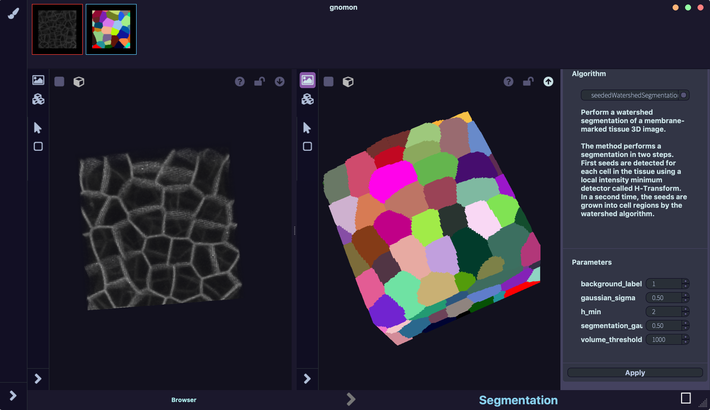

======================
Segmentation Workspace
======================

General presentation
====================

This workspace produces segmentations of intensity images using different algorithms. It is particularly adapted to segment 3D images of multicellular tissues at cell resolution.

* **Input**: intensity image (typically coming from microscopy (confocal, light-sheet) data, representing either 2D or 3D samples).
* **Output**: a segmented image, in which each compartment of the original intensity image is identified and labeled with a unique numerical ID.

Outlay of the Segmentation workspace
====================================

    Segmentation workspace

The workspace consists of three main specific zones:

* input 3D viewer,
* output 3D viewer and
* configuration panel.

The input 3D viewer (left) contains the intensity image to be segmented, while the output (rightmost) viewer displays the result of the selected segmentation plugin.  Users can select the plugin from a plugin list appearing in the drop-down menu on the right-hand side configuration panel. A brief description of the plugin appears below together with a set of parameters with default values that control the plugin algorithm. Once the parameters are set to their desired values, users can apply the algorithm to the intensity image shown in the leftmost viewer by clicking on the "Apply" button. The result is displayed on the rightmost viewer (note that depending on the algorithm and the input image, this operation may take a variable amount of time).

Each 3D viewer is equipped with two user bars:

* a vertical bar for visualization options on the left and
* a horizontal bar on top.

The visualization options are accessible in a menu from the vertical bar on the left of each figure. There, users can set the colormap used to display each image, or switch between the different ways of interacting with each image. For segmented images, users may also toggle between the volumetric and the surface-mesh representations of segmented objects.

On top of each viewer, the horizontal bars provides icons to switch between a full 3D and a 2D-cut view of each image (for three-dimensional data). Also, the visualization of the input and output images can be synchronized by activating the two lock icons in each viewer. In this way, rotations, translations and zooms applied to the image in one viewer is automatically reported on the image in the other viewer. In the same bar, users find a help button and the option to export each image to the form manager through the UP arrow button.

Example of use
==============

**Importing an intensity image:**  After opening an intensity image in the Browser Workspace and having exported it to the form manager, users can import it into the left viewer of the Segmentation Workspace by drag-and-drop or through the DOWN arrow button on the image icon.

**Selecting, setting and running a plugin:** After selecting the desired segmentation algorithm on the plugin Panel on the rightmost part of the Workspace, users can set the parameters to specific values or leave them to their default values.

Clicking on the Apply button runs the plugin algorithm on the input image. After completion, the resulting segmented image appears on the right viewer of the workspace.

**Visualizing the result:** Users can then select their preferred visualization option in the visualization menu of the left viewer. For instance, they can change the colormap used to identify each segmented object, or they can toggle on/off the surface mesh visualization option.

When surface meshes are visualized, a Reticle button appears on the left among the possible user-image interaction styles. By activating this style, users can click on each segmented object to obtain information associated with it (such as, for instance, its unique numerical ID).

**Overlaying intensity and segmentation images:** The original intensity image from the Form Manager can be drag-and-dropped into the right viewer. As a  result, the intensity and segmented images are overlayed, facilitating the assessment of the quality of segmentation achieved.

Related workspaces
==================

**Upstream of the Segmentation workspace:** Three-dimensional intensity images, inputs of the Segmentation Workspace, might  directly come from a file via the **Browser workspace** or might have been produced as outputs of the **Fusion workspace**.

**Downstream of the segmentation workspace:** segmented images, can then be quantitatively analyzed in the **Cell analysis workspace** or further processed in the **Cell reconstruction workspace**.
