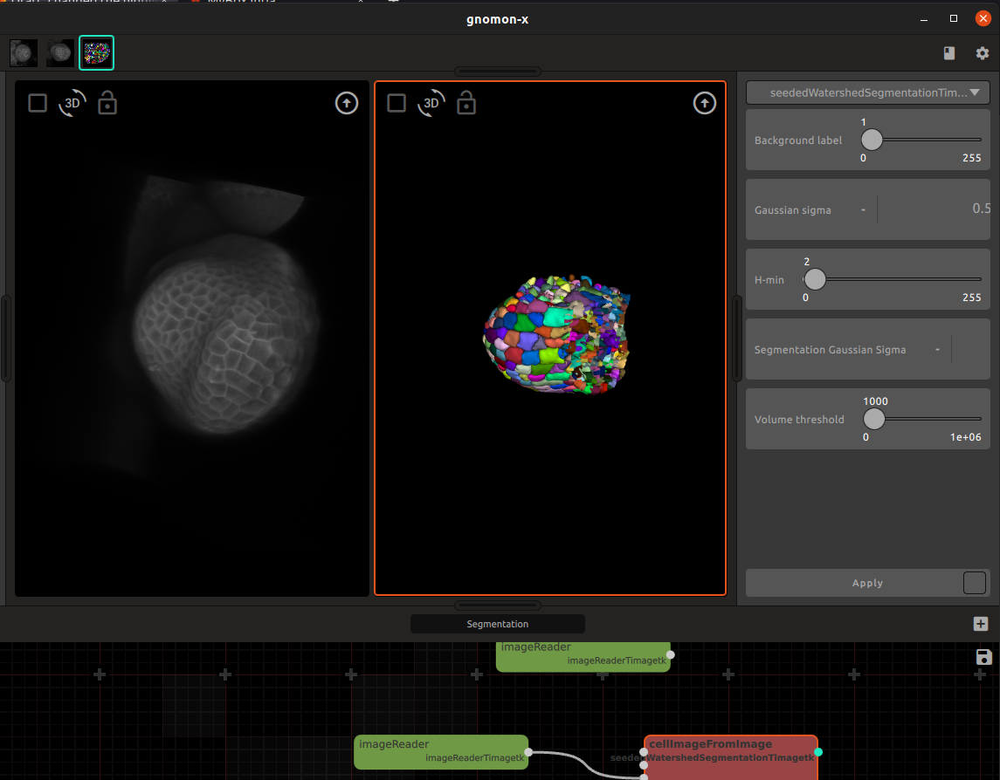

# Concepts

Gnomon provides a new *integrated modeling environment* (IME) for studying morphogenesis in biology.

This IME provides a *project manager*, a *session manager*, *workspaces* to apply families of algorithms to forms (to transform them), *plugins* corresponding to algorithms able to transform forms, a data bus called the *form manager* to handle computed forms, and *abstractions* that formalize and unify in the system the notion of :math:`(DS)^2` simulation.


## Forms

In Gnomon, a biological organism or organ is represented as *a form*. Formally, a form is a combinatorial object such as an image, a string, a tree, a graph, a matrix, a multiscale graph, a cell complex, an hyper-graph, *etc.*, representing the structure of a developing system in terms of its components and their arrangement at some scale(s) or a measure of this structure. These components may be overloaded with attributes representing geometric, biological or physical properties and often themselves represented as scalar or vectorial values. Altogether the form defines the state of the biological system or a measure of this state.


**top row from left to right** - microscope image of a meristem, confocal image of a meristem, mesh constructed from a segmented meristem, segmented ascidian embryo; **bottom row from left to right** - cell lineages of ascidian development, tree graph and its DAG compression, plant simulated branching structure)

A form can evolve in time and its components, their organization or their properties can vary. This defines dynamical systems with dynamical structure.


    
Measures make it possible to get partial information on system's form (state) from real data. For example, in the case of a developing embryo where the system's state is represented by a graph of cells, a measure of the state may be carried out using a light sheet microscope, providing images of the embryo state. These images can then be used to segment the cells, construct their topological graph, and possibly extract cell geometrical attributes (such as shape envelope, volume or compactness) or biologically-related attributes (such as genetic activity, hormone concentration, cell polarity, *etc.*).

Gnomon provides a new computational environment dedicated to the modeling and simulation of morphogenesis to manipulate these dynamical forms, construct them, explore them, simulate them.

Interestingly, Gnomon manipulates natively not only forms, but also sequences of forms, which formalizes the idea of a biological system developing throughout time. Many of its workspaces are able to handle directly temporal sequences of forms.

```latex
n_{\mathrm{offset}} = \sum_{k=0}^{N-1} s_k n_k
```


## Form manager

The form manager is a bus of data structures representing forms and containing the objects and state variables shared by the different models. It is a set of data structures that can be globally accessed by all the workspaces. Form manager objects are augmented with meta-data that indicate their characteristics and provenance.

Forms stored in the form manager can be explored by expanding down thee form manager. This provides detailed metadata associated with the form together with the possibility to explore it with a 2D/3D viewer.

TODO screenshot
Form manager (top row of icons: stores the state of different forms that have previously been computed in different workspaces)

## Workspaces

A workspace is a central Gnomon concept that has been introduced to bring ergonomy at the forefront of the system. The user interacts with specific data structures and algorithms through dedicated workspaces. Basically, a workspace provides a graphical interface to a high-level operation that one may want to carry out on a form.

For example, a specific workspace is defined for 3D image segmentation operations. The precise segmentation algorithm used (e.g. watershed, ...) appears as a specific plugin in this workspace, and can be selected by the user in a plugin menu offered by the workspace.

    

Other workspaces make it possible to run simulations. A LPy workspace for example is used to grow an initial tree structure (that may be provided through the form manager by a file or another workspace) based on L-system rules implementing an evolution function into a new tree structure representing the form development at some specified time point.

Work in a workspace mainly consists in importing a form coming from the form manager (or from a file), choosing a plugin (dedicated algorithm for processing the form offered by the workspace) from a predefined list, setting the algorithm parameters, apply the algorithm to the form, and upload the final result back to the form manager.

Workspaces can import input forms or export computed output forms using drag-and-drop operation from and to the form manager.


## Pipeline

During a session, the user manipulates workspaces to process input forms and transform them as output stored in the form manager. In fact, the import/export operations carried out in each workspace from and to the form manager, are interpreted by Gnomon as the creation of links beween corresponding workspaces. The result is a graph whose nodes are the workspace and edges corresponds to data input and output by the different workspaces. This graph is called a **Pipeline**. Its current state can be vizualize at any moment by bringing it to the front of the Gnomon display, manipulated to change some node attributes, etc.

The pipeline can be exported so that the whole simulation is run in batch in a shell on a series of new input data. 

The Pipeline can also be re-loaded to resume a previous work.

