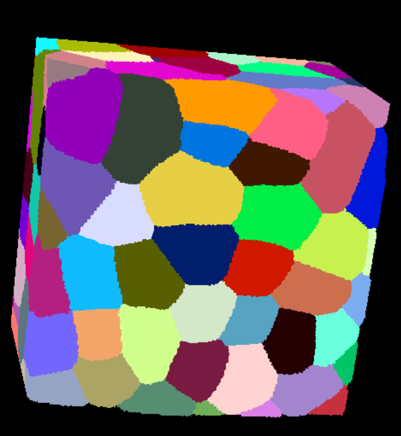

# Cell Image

## Description
>A gnomon Cell Image is a data strucure which could hold time series segmented image.  
The correspoonding class in gnomon is `gnomonCellImageDataTissueImage`.  
It gives possibility to access some information about image like: 
- Cell property
- Number of cells
- Dimensions
- Voxel Size

## Default reader plugin
> The default reader of cell image form is **cellImageReaderTimagetk**. Which reads a 3D image file.  
Extensions supported by this reader are: `tif, inr.gz, inr`.

## Default writer plugin
>The default writer of cell image form is **cellImageWriterTissueImage**

## Gnomon Cell Image Example



## Plugins which took Cell Image as input

>Here is a non exhaustive list of some algorithms which took this form as input.  
- morphoCellFilter
- seededWatershedSegmentationTimagetk
- signalQuantificationImageSignal

## Plugins which produce Image as output
> Here is a non exhaustive list of some algorithms which produce this form as output.  
- seededWatershedSegmentationTimagetk
- seedImageDetectionTimagetk
- surfaceCellCurvature

```python
from dtkcore import d_inliststring
from dtkcore import d_int

from gnomon.utils import algorithmPlugin
from gnomon.utils import load_plugin_group
from gnomon.utils.decorators import cellImageInput
from gnomon.utils.decorators import cellImageOutput
from gnomon.core import gnomonAbstractCellImageFilter

from timagetk.algorithms.morphology import label_filtering
from timagetk.components.tissue_image import TissueImage3D

load_plugin_group("cellImageData")

@algorithmPlugin(version="0.3.1", coreversion="0.80.0")
@cellImageInput("in_tissue", data_plugin="gnomonCellImageDataTissueImage")
@cellImageOutput("out_tissue", data_plugin="gnomonCellImageDataTissueImage")
class morphoCellFilter(gnomonAbstractCellImageFilter):

    def __init__(self):
        super(morphoCellFilter, self).__init__()
        self.in_tissue = {}
        self.out_tissue = {}

        self._parameters = {}
        self._parameters['method'] = d_inliststring("Morphological operation to apply", "erosion", ["erosion", "dilation", "opening", "closing"])
        self._parameters['radius'] = d_int("Radius of the structuring element", 1, 1, 50)
        self._parameters['iterations'] = d_int("Number of iteration of the morphological operation", 1, 1, 5)

    def run(self):
        self.out_tissue = {}

        for time in self.in_tissue.keys():
            img = self.in_tissue[time]  # This is a SpatialImage!
            filtered_img = label_filtering(img,
                                           method=self['method'],
                                           radius=self['radius'],
                                           iterations=self['iterations'])

            tissue = TissueImage3D(filtered_img, background=1, not_a_label=0)
            self.out_tissue[time] = tissue
```
