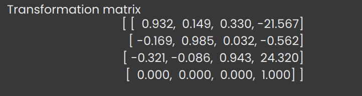

#  Data Dict

## Description
>Gnomon Data Dict Data is a python dictionnary. The corresponding class in gnomon is `gnomonNumpyDataDictData`.
The **key** is a string and the **value** can be a int, string, bool, float or a numpy array.
If it's a numpy array the dimension has to be <= 4 and the type needs to be NPY_INT or NPY_DOUBLE. 


## Default reader plugin
>The reader of data dict form is **gnomonDataDictReaderJson**. It loads a Json file as a dictionary.  
This reader supports one extension `json`.  

## Default writer plugin
>The default writer of data dict form is **gnomonDataDictWriterJson**

## Gnomon Data Dict Example



## Plugins which took Data Dict as input
>Here is an algorithm which took this form as input.  
- cellSuperpositionTracking

## Plugins which produce Data Dict as output
>Here is an algorithm which produce Data Dict as output.  
- registrationTimagetk

## A Use Case, Registration
```python
import logging
from copy import deepcopy

import numpy as np

from dtkcore import d_inliststring, d_real, d_int, d_string

from gnomon.utils import algorithmPlugin
from gnomon.utils.decorators import dataDictOutput, imageInput
from gnomon.utils.decorators import imageOutput
from gnomon.core import gnomonAbstractImageRegistration

from timagetk.algorithms.blockmatching import blockmatching
from timagetk.algorithms.trsf import apply_trsf
from timagetk.tasks.registration import consecutive_registration
from timagetk import MultiChannelImage, SpatialImage


@algorithmPlugin(version="0.3.1", coreversion="0.72.0")
@imageInput("_in_img", data_plugin="gnomonImageDataMultiChannelImage")
@dataDictOutput("_out_img_transform_dict", data_plugin="gnomonNumpyDataDictData")
@imageOutput("_out_img", data_plugin="gnomonImageDataMultiChannelImage")
class registrationTimagetk(gnomonAbstractImageRegistration):

    def __init__(self):
        super().__init__()

        self._in_img = {}
        self._out_img = {}
        self._out_img_transform_dict = {}

        self._parameters = {}
        self._parameters['channel'] = d_inliststring("Channel", "", [""], "Signal channel on which to perform the temporal registration")
        self._parameters['method'] = d_inliststring("Method",  "rigid", ["rigid", "affine", "vectorfield"], "Method for the image registration : rigid, affine or deformable (vectorfield)")
        self._parameters['estimator'] = d_inliststring("Estimator", 'wlts', ['wlts', 'lts', 'wls', 'ls'], "Transformation estimator")
        self._parameters['pyramid_lowest'] = d_int("Pyramid lowest", 2, 0, 4, "Lowest level at which to compute deformation.")
        self._parameters['pyramid_highest'] = d_int("Pyramid highest", 5, 1, 5, "Highest level at which to compute deformation.")
        self._parameters['elastic_sigma'] = d_real("Elastic sigma", 1, 0, 3, 1, "Transformation regularization, sigma for elastic regularization (only for vector field). "
                                                   "This is equivalent to a gaussian filtering of the final deformation field.")
        self._parameters['fluid_sigma'] = d_real("Fluid sigma", 1, 0, 3, 1, "Sigma for fluid regularization ie field interpolation and regularization for pairings (only for vector field). "
                                                   "This is equivalent to a gaussian filtering of the incremental deformation field.")

        self._parameter_groups = {}
        for parameter_name in ["estimator", "pyramid_lowest", "pyramid_highest", "elastic_sigma", "fluid_sigma"]:
            self._parameter_groups[parameter_name] = 'advanced'

        self.__doc__ = consecutive_registration.__doc__

    def run(self):
        self._out_img = {}

        imgs = self._in_img
        imgs = [imgs[time] for time in imgs.keys()]

        logging.info("nb imgs in imgs: " + str(len(imgs)))
        if 'channel' in self._parameters.keys():
            registration_imgs = [deepcopy(img.get_channel(self['channel'])) for img in imgs]
        else:
            registration_imgs = [deepcopy(img.get_channel(img.channel_names[0])) for img in imgs]

        reference_imgs = registration_imgs

        for time in range(len(imgs) - 1)[::-1]:

            transform = blockmatching(floating_image=registration_imgs[time],
                                      reference_image=reference_imgs[time+1],
                                      method=self['method'],
                                      pyramid_lowest_level=self['pyramid_lowest'],
                                      pyramid_highest_level=self['pyramid_highest'],
                                      elastic_sigma=self['elastic_sigma'],
                                      fluid_sigma=self['fluid_sigma'],
                                      # params=self['extra_args'],
                                      estimator=self['estimator'])
            reference_imgs[time] = apply_trsf(registration_imgs[time], transform, template_img=reference_imgs[time+1])

            logging.info("transform: " + str(transform))

            temp_output_images = []
            for channel in imgs[time+1].keys():
                if ('channel' in self._parameters.keys()):
                    temp_output_images.append(apply_trsf(imgs[time].get_channel(channel), transform, template_img=imgs[time+1].get_channel(channel)))
                else:
                    temp_output_images.append(apply_trsf(imgs[time].get_channel(imgs[time].channel_names[0]),
                                                        trsf=transform,
                                                        template_img=imgs[time+1].get_channel(imgs[time+1].channel_names[0])))
                    # self._out_img[0][""] = registered_img

            self._out_img[time] = MultiChannelImage(temp_output_images, channel_names=imgs[time].keys())
            self._out_img_transform_dict[time] = {}
            self._out_img_transform_dict[time]["transform"] = transform.get_array().astype(float)

            if time == len(imgs) - 2:
                self._out_img[time+1] = imgs[time+1]
                self._out_img_transform_dict[time+1] = {}
                self._out_img_transform_dict[time+1]["transform"] = np.eye(4)
```


