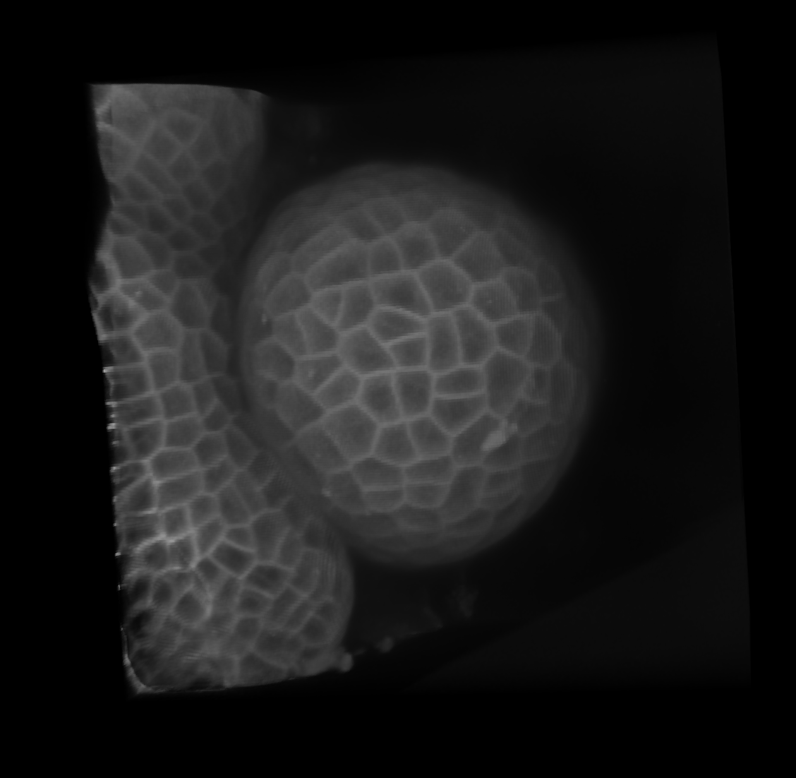

# Image

## Description
>A gnomon Image is a data strucure which could hold time series image in one channel or multi-channel (4D data set).  
The corresponding class in gnomon is `gnomonImageDataMultiChannelImage`.  
It gives possibility to access some information about image like: 
- Number of channels
- Dimensions
- Voxel Type
- Voxel Size


## Default reader plugin
>The default reader of image form is **imageReaderTimagetk**. Which reads a 3D microscopy intensity image file.<br> Extensions supported by this reader are: `inr, inr.gz, mha, .mha.gz, tif, tiff, czi, lsm`.

## Default writer plugin
>The default writer of image form is **gnomonImageWriter**

## Gnomon Image Example




## Plugins which take Image as input

>Here is a non exhaustive list of some algorithms which take this form as input.  
- boundaryEdgeEnhancement
- linearFilterTimagetk
- binarization
- lsmCellsSegmentation

## Plugins which produce Image as output
> Here is a non exhaustive list of some algorithms which produce this form as output.  
- anisotropic3dImageEnhancement
- edgeIndicatorLSM3d
- linearFilterTimagetk
- registrationTimagetk

## A Use Case, Resampling an image
```python
from copy import deepcopy
import numpy as np

from dtkcore import d_real

import gnomon.core
from gnomon.utils import algorithmPlugin
from gnomon.utils.decorators import imageInput, imageOutput

from timagetk.algorithms.resample import isometric_resampling


@algorithmPlugin(version='0.3.1', coreversion='0.80.0')
@imageInput(attr='in_img', data_plugin='gnomonImageDataMultiChannelImage')
@imageOutput(attr='out_img', data_plugin='gnomonImageDataMultiChannelImage')
class isometricResampling(gnomon.core.gnomonAbstractFormAlgorithm):

    def __init__(self):
        super().__init__()

        self._parameters = {}
        self._parameters['voxelsize'] = d_real("Voxelsize", 1., 0.1, 5., 2, "Target voxelsize after resampling")

        self.in_img = {}
        self.out_img = {}

    def run(self):
        self.out_img = {}

        for time in self.in_img.keys():
            resampled_img = isometric_resampling(deepcopy(self.in_img[time]), method=self['voxelsize'])
            self.out_img[time] = resampled_img

```
 