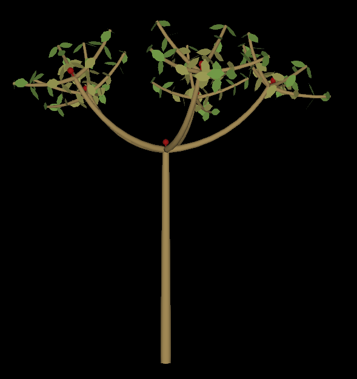

# LString

## Description
>A gnomon LString is a data strucure which represents the temporal evolution of a branching structure, as generated by a [Lindenmayer System](https://en.wikipedia.org/wiki/L-system)
The default data class implementing LString in gnomon is `lStringDataLPy` that relies on the L-System implementation provided by the [L-Py](https://lpy.readthedocs.io/en/latest/) Python package.  


## Default reader plugin
>The default reader of lstring form is **lStringReaderText** which reads a lstring from a plain text conforming with the [nested brackets representation](https://lpy.readthedocs.io/en/latest/user/lsystems.html?highlight=brackets#string-representation) and saved as a `.txt` file.


## Gnomon LString Example




## Generating LString forms 

>LStrings are very versatile forms that are typically used to represent plant architecture, or other evolving branching structures, in the context of model simulations. The common may to generate lstrings is to define a model through the `L-System Model` workspace.

The `lStringEvolutionModelLPy` plugin allows to read a [L-Py code](https://lpy.readthedocs.io/en/latest/user/filesyntax.html#canvas-of-l-py-file) in order to define a L-System that can be run through the Gnomon interface. The resulting trajectory of L-System states generates a time series of LString forms that is displayed in 3D using the [interpretation rules](https://lpy.readthedocs.io/en/latest/user/lsystems.html#different-types-of-rules) of the same L-System.

## A Use Case, Visualizing LString module sequence in Matplotlib

```python
import numpy as np

import matplotlib.pyplot as plt

import gnomon.visualization
from gnomon.utils import visualizationPlugin
from gnomon.utils.decorators import lStringInput

import openalea.lpy as lpy


@visualizationPlugin(version="0.4.0", coreversion="0.81.1")
@lStringInput('lstring', "lStringDataLPy", name="LString Module Sequence")
class gnomonLStringMplVisualization(gnomon.visualization.gnomonAbstractLStringMplVisualization):
    
    def __init__(self):
        super().__init__()

        self._parameters = {}
        self.lstring = None
        self.ls = None

        self.figure = None

    def __del__(self):
        self.figure.clf()

    def setLString(self, lString):
        self.lstring = lString
        self.ls = self.lstring.data()._lstring

    def clear(self):
        if self.figure is not None:
            self.figure.clf()
            self.figure.canvas.draw()

    def setVisible(self, visible):
        pass

    def update(self):
        if self.lstring is None:
            return

        if self.figure is None:
            self.figure = plt.figure(self.figureNumber())
        self.figure.clf()

        if len(self.ls) > 0:
            modules = np.unique([n.name for n in self.ls])
            color_sequence = plt.rcParams['axes.prop_cycle'].by_key()['color']
            module_colors = {m: color_sequence[i % len(color_sequence)] for i, m in enumerate(modules)}

            square_size = int(np.ceil(np.sqrt(len(self.ls))))

            for i,n in enumerate(self.ls):
                module_x = i%square_size - square_size/2
                module_y = square_size/2 - i//square_size

                size = (500/square_size)/np.sqrt(len(n.name))

                self.figure.gca().text(module_x,module_y,n.name,ha='center',va='center',size=size,color=module_colors[n.name])

            self.figure.gca().set_xlim(-square_size/2,square_size/2)
            self.figure.gca().set_ylim(-square_size/2,square_size/2)
        else:
            print("The L-String has no modules...")

        self.figure.gca().axis('off')
        self.render()

    def render(self):
        if self.figure is not None:
            self.figure.canvas.draw()

```