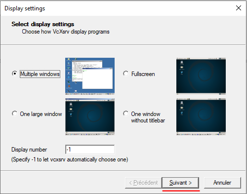
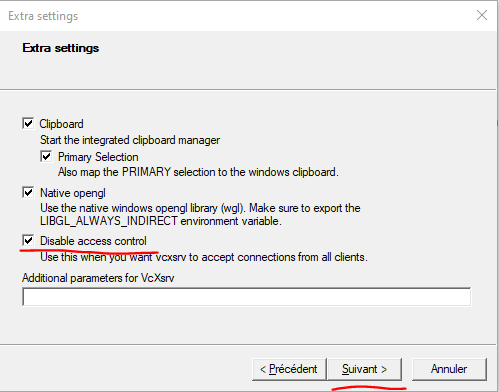
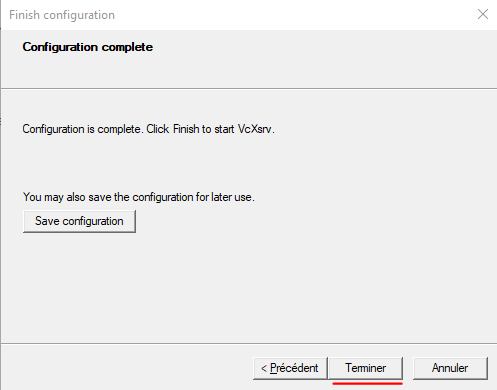

# How to install gnomon

## [Mac and Linux] Install gnomon using conda

### Prerequisite: Install Conda
- Make sure you have `conda` installed on your system. To check, simply open a new terminal window and type:
```shell script
conda
```

- If `conda` is installed, you should get a long return value describing how to use the command, otherwise you will get a `command not found` message.

- If `conda` is not installed, we recommend that you [install Miniconda](https://docs.conda.io/en/latest/miniconda.html) by picking the *latest* installer suitable for your system.

:::{admonition} About Conda and Miniconda
Conda is an open source package management system and environment management system that runs on Windows, macOS and Linux. Conda quickly installs, runs and updates packages and their dependencies. Conda easily creates, saves, loads and switches between environments on your local computer. Find out more on [the official documentation](https://docs.conda.io/en/latest/)

[Miniconda](https://docs.conda.io/en/latest/miniconda.html) is a free minimal installer for conda. It is a small, bootstrap version of Anaconda that includes only `conda`, Python, the packages they depend on, and a small number of other useful packages, including pip, zlib and a few others.
:::

### Install Gnomon

:::{warning}
Installing `gnomon` requires around *6 GB* of free disk space.
:::

- **Step 1:** Install Mamba in your `(base)` environment
```shell script
conda install -n base -c conda-forge mamba
```

- **Step 2:**  Create a conda environment with the right python version. Then activate this environment
```shell script
conda create -n gnomon python=3.9

conda activate gnomon
```

For Mac M1, you need to tell conda to use x86 architecture like this:

```shell script
CONDA_SUBDIR=osx-64 conda create -n gnomon python=3.9
conda activate gnomon
conda config --env --set subdir osx-64
```

- **Step 3:** Install **gnomon** and its **dependencies**
```shell script
mamba install -c dtk-forge6 -c gnomon -c mosaic -c morpheme -c conda-forge gnomon
```

:::{note}
At this stage the `gnomon` application is installed but it is "empty" since no plugins are installed by default. To actually make it useable, you will have to install **plugin packages**
:::

- **Step 4:** Install plugin packages for gnomon for instance:
```shell script
mamba install -c gnomon -c dtk-forge6 -c conda-forge -c mosaic -c morpheme gnomon_package_tissueimagemesh
```

- **Step 5:** Congrats, you can now launch the application
```shell script
gnomon
```

### Update `gnomon`

- **Step 1:** Activate your `(gnomon)` environment
```shell script
conda activate gnomon
```

- **Step 2:**  Update **gnomon** and its **dependencies**
```shell script
mamba update -c dtk-forge6 -c gnomon -c mosaic -c morpheme -c conda-forge gnomon
```

## [Windows] Install with Windows Subsystem for Linux (WSL)

Sources used for these instructions are:

 - [Open GUI apps on Windows Subsystem for Linux](https://www.youtube.com/watch?v=ymV7j003ETA&t=6s) (youtube)
 - [VcXsrv](https://sourceforge.net/p/vcxsrv/wiki/VcXsrv%20%26%20Win10/) sur SourceForge.

### 1. Install the following dependencies

1. [WSL 2](https://docs.microsoft.com/fr-fr/windows/wsl/install).
2. [Putty](https://www.putty.org).
3. **VcXsrv**, avalable on [Source Forge](https://sourceforge.net/p/vcxsrv/wiki/VcXsrv%20%26%20Win10/).

### 2. Configure WSL

A `$DISPLAY` variable has to be defined to choose on which screen/computer to display. To configure it do this:

```
\> export DISPLAY=$(route.exe print | grep 0.0.0.0 | head -1 | awk '{print $4}'):0
```

Now, if you print `$DISPLAY`, you should see an IP followed by `:0` such as:

```
> \> echo $DISPLAY
>
> \> 131.254.160.46:0
```

This IP is not constant and as to be set at each start of the WSL. You can tune your `~/.bashrc` to set this variable at each WSL startup is you want.

Install `awk` is needed (for example on debian based distributions:  `sudo apt install awk` ).

### 3. Configure X

#### VcXsrv

Once installed, launch **XLauch** and select options as shown below :

1. Select display setting for windows. Then click *Next*.



2. Clic on *Next*


3. Tick `Disable access control` (Note: *When it's ticked, the X server VcXsrv is open to extern connections.*). Clic on *Next*.



4. Clic on `Finish`.



#### Putty & SSH

Start **SSH service** on WSL :

```
> \> sudo service ssh start
```

On WSL, type the command `ip addr show eth0` and note the IP address. This step should be done at each start of WSL.

Launch Putty and configure the following parameters before connecting to WSL:

1. Type the IP you just noted


2. In the Menu `SSH > X11`, tick `Enable X11 Forwarding`.


3. You can now start the session.

### 4. Launch gnomon

You can now launch gnomon through the *WSL console*:
```
gnomon
```
